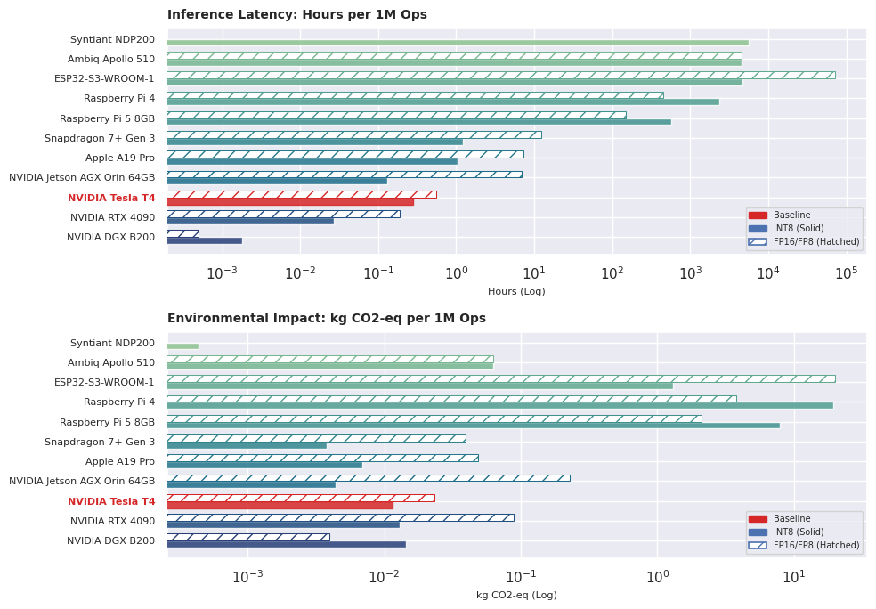

# Edge_AI_Perf


## Installation:
(Use `!pip` for notebook installations, Jupyter, Colab, etc.)
```
pip install git+https://github.com/pmdscully/geo_northarrow.git
```


```bash
!pip install git+https://github.com/pmdscully/Edge_AI_Perf.git --upgrade
```


```python
from lib_edge_eval import fetch_edge_hardware_dataframe, calculate_edge_metrics, Plotting

# ---- Data from model (e.g. ExecuTorch/ PyTorch):
pte_size_bytes = 9e5
weight_dtype = 'int8'  # Parameter dtype, i.e. quantized / unquantized, int32, fp16, int4, int8, etc. Currently
baseline_time_ms = 1   # 
```


* Specify the hardware used (in your current environment) for the baseline
  * Estimates are calculated

```python
# ======= Calculate from Baseline: ========
df_final = fetch_edge_hardware_dataframe()
baseline_index = 8 # 8 = NVIDIA T4 GPU
baseline_memory_bytes = pte_size_bytes
baseline_time_ms = 1
baseline_dtype = weight_dtype if weight_dtype ['int8','fp8'] else 'fp8'

# Execution call
df_comparison = calculate_edge_metrics(
    df=df_final,
    baseline_idx=baseline_index,
    baseline_ms=baseline_time_ms,
    baseline_mem=baseline_memory_bytes,
    baseline_dtype=baseline_dtype
)

display(df_comparison.round(2))
Plotting.plot_comparison_metrics(df_comparison)
```

* 

|      | Device Name                 | Baseline | Int8/FP8 Params Fit (Est.) | Hours per 1M INT8 | Hours per 1M FP16 | KWh per 1M INT8 | KWh per 1M FP16 | CO2-EQ per 1M INT8 | CO2-EQ per 1M FP16 |
| ---- | --------------------------- | -------- | -------------------------- | ----------------- | ----------------- | --------------- | --------------- | ------------------ | ------------------ |
| 0    | Syntiant NDP200             |          | 🗸                          | 712.20            | NaN               | 0.00            | NaN             | 0.00               | NaN                |
| 1    | Ambiq Apollo 510            |          | 🗸                          | 569.76            | 569.76            | 0.01            | 0.01            | 0.01               | 0.01               |
| 2    | ESP32-S3-WROOM-1            |          | 🗸                          | 593.50            | 9116.16           | 0.30            | 4.56            | 0.17               | 2.54               |
| 3    | Raspberry Pi 4              |          | 🗸                          | 294.07            | 56.98             | 4.41            | 0.85            | 2.45               | 0.48               |
| 4    | Raspberry Pi 5 8GB          |          | 🗸                          | 71.22             | 18.99             | 1.78            | 0.47            | 0.99               | 0.26               |
| 5    | Snapdragon 7+ Gen 3         |          | 🗸                          | 0.15              | 1.56              | 0.00            | 0.01            | 0.00               | 0.00               |
| 6    | Apple A19 Pro               |          | 🗸                          | 0.13              | 0.92              | 0.00            | 0.01            | 0.00               | 0.01               |
| 7    | NVIDIA Jetson AGX Orin 64GB |          | 🗸                          | 0.02              | 0.86              | 0.00            | 0.05            | 0.00               | 0.03               |
| 8    | NVIDIA Tesla T4             | 🗸        | 🗸                          | 0.04              | 0.07              | 0.00            | 0.01            | 0.00               | 0.00               |
| 9    | NVIDIA RTX 4090             |          | 🗸                          | 0.00              | 0.02              | 0.00            | 0.02            | 0.00               | 0.01               |
| 10   | NVIDIA DGX B200             |          | 🗸                          | 0.00              | 0.00              | 0.00            | 0.00            | 0.00               | 0.00               |


