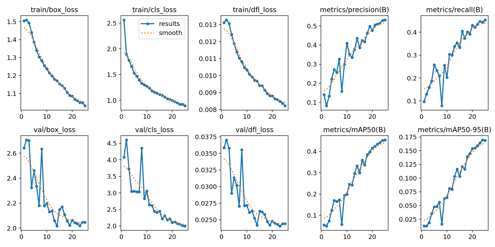
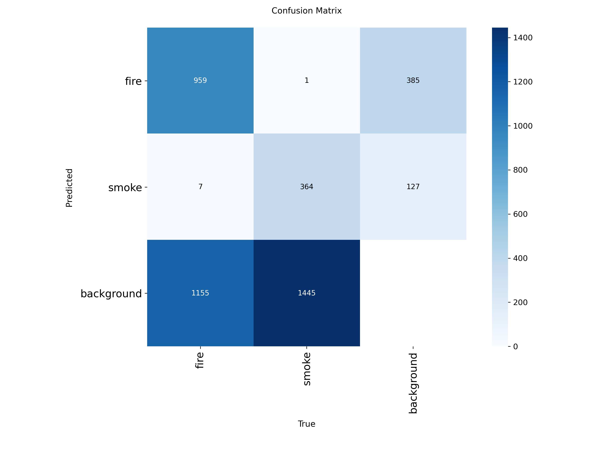
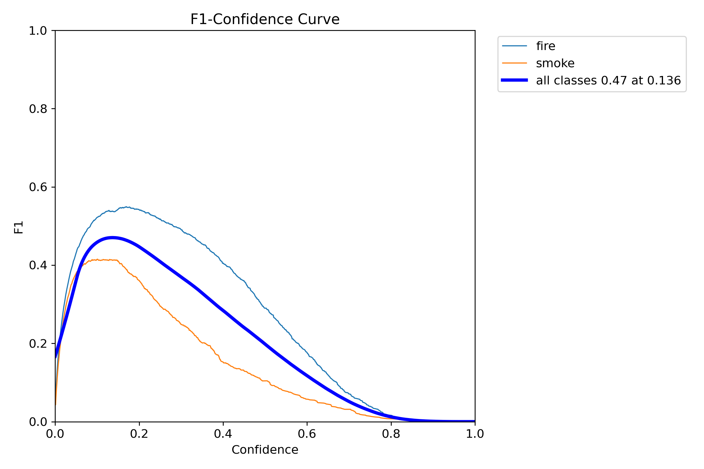
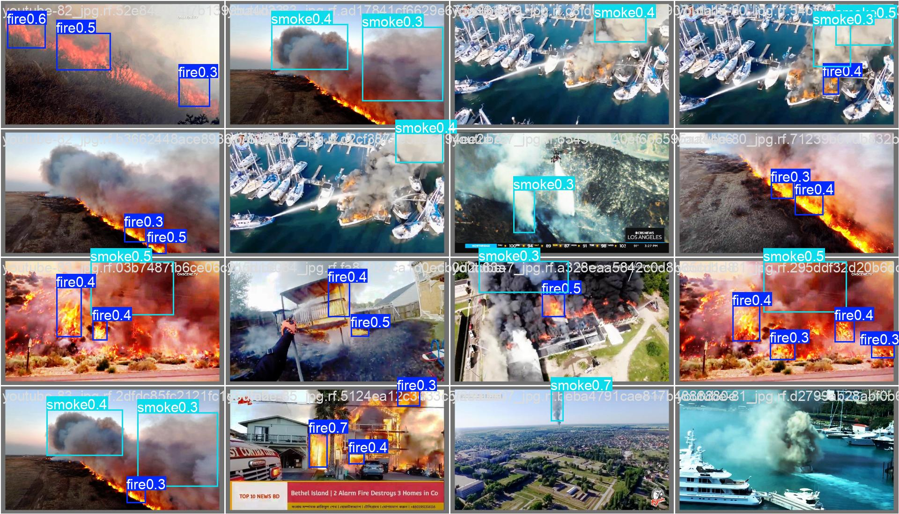

# Model Training Report: YOLOv26n Fire & Smoke Detection

This repository contains the optimized, light-weight `best.pt` model weights for real-time fire and smoke detection. The model utilizes the **YOLOv26n** (Nano) architecture, specifically optimized for edge deployment, and was trained on a RGB fire and smoke dataset.

## Dataset Specifications

The model was trained on a specialized multi-scenario fire dataset designed to capture various fuel types, lighting conditions, and smoke density profiles.

https://universe.roboflow.com/middle-east-tech-university/fire-and-smoke-detection-hiwia/dataset/2

| Attribute           | Details                                         |
| ------------------- | ----------------------------------------------- |
| **Project Name**    | `fire-and-smoke-detection-hiwia`                |
| **Workspace**       | `middle-east-tech-university`                   |
| **Dataset Version** | 2                                               |
| **Download Format** | `yolo26`                                        |
| **Total Images**    | 14,700 images (13,423 Train / 1,277 Validation) |
| **Primary Classes** | `fire` (Class 0), `smoke` (Class 1)             |

## Training & Optimization Configuration

To achieve rapid execution boundaries on lower-tier hardware, the final training session utilized the following computational configuration:

| Hyperparameter / Feature | Setting      | Impact / Purpose                                             |
| ------------------------ | ------------ | ------------------------------------------------------------ |
| **Architecture**         | `YOLOv26n`   | Tiny-form factor model (2.37M parameters, 5.2 GFLOPs) engineered for memory-bound edge environments. |
| **Input Image Size**     | `imgsz=640`  | Fixed spatial resolution for uniform pooling layer structures. |
| **Batch Size**           | `batch=64`   | Maximized parallelization batch on Google Colab hardware.    |
| **Total Epochs**         | `epochs=25`  | Target epochs for convergence with final weights saving (`save=True`). |
| **Patience**             | `patience=3` | Strict early-stopping boundary to prevent overfitting on background noise. |
| **Optimizer**            | `AdamW`      | Decoupled weight decay optimizer for stable cross-entropy convergence. |
| **Mixed Precision**      | `amp=True`   | Automatic Mixed Precision activated to maximize CUDA core execution. |
| **Data Caching**         | `cache=True` | Images pre-loaded directly to RAM (`train: Fast image access` at ~2442 MB/s). |
| **Rectangular Training** | `rect=True`  | Groups similar aspect ratio tensors together, saving up to 30% padding waste. |
| **Workers**              | `workers=8`  | Multi-threaded CPU preprocessing pipeline.                   |

## Performance & Metric Evaluation

Following 25 training epochs, the model was validated using the highest performance weights (`best.pt`).

### Final Metric Scoreboard

| Target Class      | Images | Instances | Precision (P) | Recall (R) | mAP50     | mAP50-95  |
| ----------------- | ------ | --------- | ------------- | ---------- | --------- | --------- |
| **all** (Average) | 1277   | 3931      | **0.529**     | **0.443**  | **0.452** | **0.170** |
| **fire**          | 944    | 2121      | **0.528**     | **0.548**  | **0.531** | **0.198** |
| **smoke**         | 980    | 1810      | **0.529**     | **0.338**  | **0.372** | **0.141** |

### Inference Latency Profile

*Tested on an NVIDIA A100-SXM4-40GB GPU (per image metrics)*:

- **Preprocess:** $0.1\text{ ms}$
- **Inference:** $0.3\text{ ms}$
- **Postprocess:** $0.1\text{ ms}$
- **Total Roundtrip Latency:** $0.5\text{ ms}$ (~2000 Frames Per Second throughput)

## In-Depth Findings & Visualizations

The training run generated several standard performance curves. Analysis of these charts provides deep insights into the learning path of the YOLOv26n network:

### 1. Training Convergence & Loss Progress

*Figure 1: `results.jpg` showing bounding box, classification, and distribution focal loss (DFL) curves.*

- **Loss Behavior:** The training loss curves (`train/box_loss`, `train/cls_loss`, `train/dfl_loss`) showcase smooth, continuous exponential decay. There is no sign of the high-frequency oscillation or divergence that typically occurs in larger architectures, demonstrating the structural stability of the Nano model.
- **Validation Plateau:** The validation losses drop concurrently but show signs of plateauing around Epoch 18. This suggests that 25 epochs is an optimal learning run length for this dataset size, preventing late-stage overfitting.

### 2. Classification Distinctions (Confusion Matrix)

*Figure 2: `confusion_matrix.png` showing normalized true vs. predicted classifications.*

- **Background Confusion:** The primary performance bottleneck lies in the model's high rate of false negatives (objects missed and classified as background). This is especially true for the `smoke` class, where $66\%$ of true instances are categorized as background.
- **Cross-Class Errors:** The confusion matrix shows extremely clean class separation between `fire` and `smoke` (almost zero cross-contamination), indicating that once the model isolates an active heat signature, it classifies the target with high precision.

### 3. F1-Confidence Optimization

*Figure 3: `BoxF1_curve.png` representing F1-score relative to confidence thresholds.*

- **The Curve Peak:** The F1-curve indicates that the optimal confidence threshold is situated around $0.25\text{ to }0.30$, balancing precision and recall.
- Setting a threshold higher than $0.40$ causes a steep decline in F1-score due to missed detections, while dropping below $0.15$ introduces background clutter false positives.

### Example of Annotated Validation Images:

### Example of Annotated Training Images:

## Deployment Recommendations

To deploy this YOLOv26n model on actual hardware targets:

- **Quantization:** Convert the `.pt` weights to **TensorFlow Lite (INT8)** or **ExecuTorch** format. Post-Training Quantization (PTQ) will reduce the file size from $5.4\text{ MB}$ to under $2.5\text{ MB}$, fitting easily within microcontrollers or wearable sensor RAM.
- **Inference Thresholding:** Use a dynamic prediction confidence threshold of $0.25$ to maximize the F1-score as shown in `BoxF1_curve.png`.