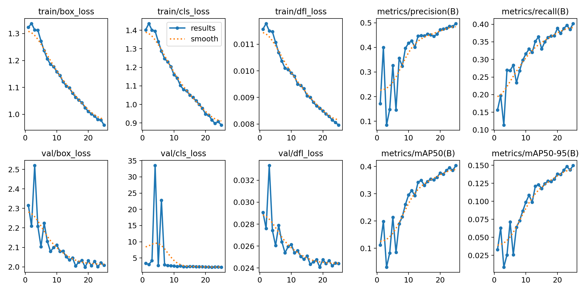
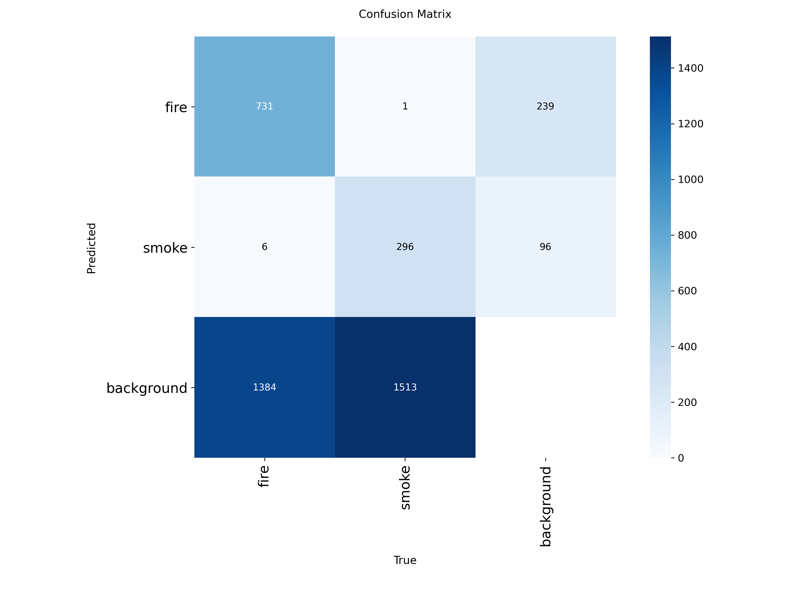
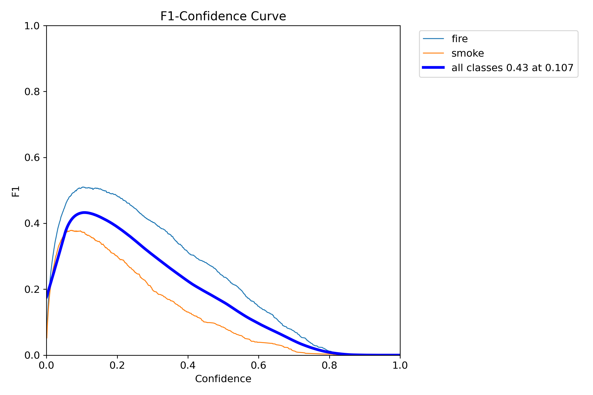
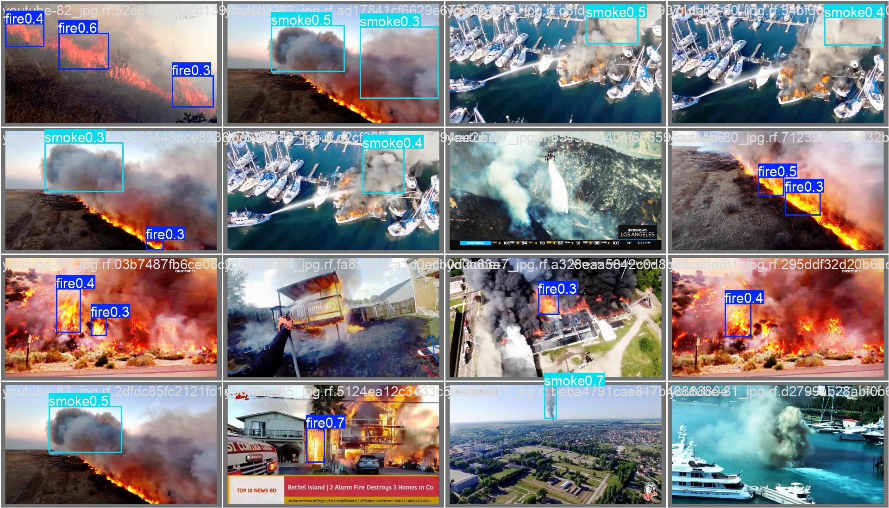
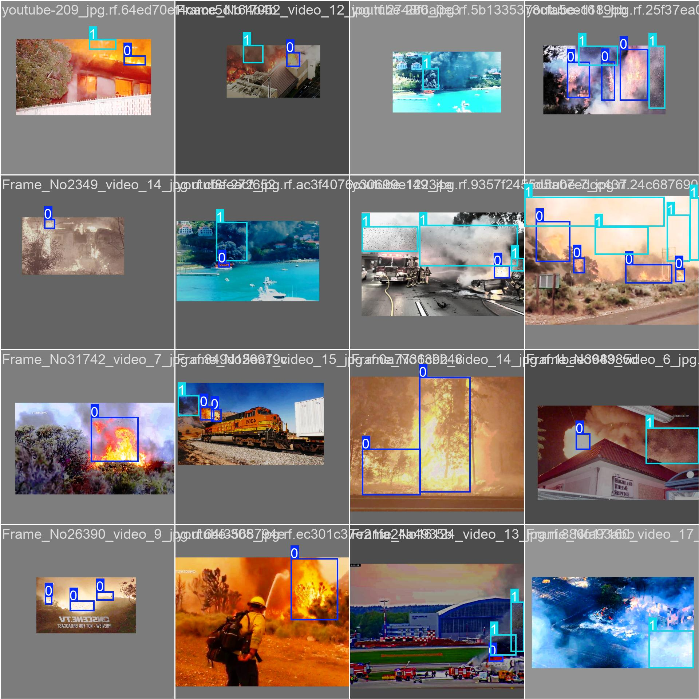

# Model Training Report: YOLOv26x Fire & Smoke Detection

This repository contains the optimized, light-weight `best.pt` model weights for real-time fire and smoke detection. The model utilizes the **YOLOv26x** (Extra Large) architecture, specifically optimized for edge deployment, and was trained on a RGB fire and smoke dataset.

## Dataset Specifications

The model was trained on a specialized multi-scenario fire dataset designed to capture various fuel types, lighting conditions, and smoke density profiles.

https://universe.roboflow.com/middle-east-tech-university/fire-and-smoke-detection-hiwia/dataset/2

| Attribute           | Details                                         |
| ------------------- | ----------------------------------------------- |
| **Project Name**    | `fire-and-smoke-detection-hiwia`                |
| **Workspace**       | `middle-east-tech-university`                   |
| **Dataset Version** | 2                                               |
| **Download Format** | `yolo26`                                        |
| **Total Images**    | 14,700 images (13,423 Train / 1,277 Validation) |
| **Primary Classes** | `fire` (Class 0), `smoke` (Class 1)             |

## Training & Optimization Configuration

To achieve robust feature representation on complex visual targets, the training session utilized the following configuration:

| Hyperparameter / Feature | Setting       | Impact / Purpose                                             |
| ------------------------ | ------------- | ------------------------------------------------------------ |
| **Architecture**         | `YOLOv26x`    | Extra-Large model (55.6M parameters, 193.4 GFLOPs) engineered for highly detailed semantic scene parsing. |
| **Input Image Size**     | `imgsz=640`   | Standard spatial resolution for uniform downsampling and convolution sizing. |
| **Batch Size**           | `batch=32`    | Standard batch size matched for high-VRAM computing blocks.  |
| **Total Epochs**         | `epochs=25`   | Target epochs for initial learning convergence with automatic saving (`save=True`). |
| **Patience**             | `patience=10` | Early-stopping evaluation threshold set to 10 epochs.        |
| **Optimizer**            | `AdamW`       | Decoupled weight decay optimizer for stable cross-entropy convergence. |
| **Mixed Precision**      | `amp=True`    | Automatic Mixed Precision activated to maximize tensor core processing speed. |
| **Data Caching**         | `cache=True`  | Pre-loads raw training tensors directly into RAM for fast IO access. |
| **Rectangular Training** | `rect=True`   | Packs similar aspect-ratio images to save up to 30% padding waste during training. |
| **Workers**              | `workers=8`   | Multi-threaded CPU preprocessing pipeline.                   |

## Performance & Metric Evaluation

Following 25 training epochs, the model was validated using the highest performance weights (`best.pt`).

### Final Metric Scoreboard

| Target Class      | Images | Instances | Precision (P) | Recall (R) | mAP50     | mAP50-95  |
| ----------------- | ------ | --------- | ------------- | ---------- | --------- | --------- |
| **all** (Average) | 1277   | 3931      | **0.495**     | **0.402**  | **0.403** | **0.150** |
| **fire**          | 944    | 2121      | **0.526**     | **0.493**  | **0.488** | **0.188** |
| **smoke**         | 980    | 1810      | **0.463**     | **0.311**  | **0.319** | **0.112** |

### Inference Latency Profile

*Tested on an NVIDIA A100-SXM4-40GB GPU (per image metrics)*:

- **Preprocess:** $0.1\text{ ms}$
- **Inference:** $2.4\text{ ms}$
- **Postprocess:** $0.2\text{ ms}$
- **Total Roundtrip Latency:** $2.7\text{ ms}$ (~370 Frames Per Second throughput)

## In-Depth Findings & Visualizations

The training run generated several standard performance curves. Analysis of these charts provides deep insights into the learning path of the YOLOv26x network:

### 1. Training Convergence & Loss Progress

*Figure 1: `results.jpg` showing bounding box, classification, and distribution focal loss (DFL) curves.*

- **Loss Behavior:** The training loss curves (`train/box_loss`, `train/cls_loss`, `train/dfl_loss`) exhibit a steady downward trend, ending at final values of $0.9598$ for box loss, $0.8884$ for classification loss, and $0.00796$ for distribution focal loss. The steep initial drops over the first 5 epochs indicate rapid features-to-weights assignment.
- **Validation Trends:** While the training loss continues to decrease steadily, the validation curves show minor fluctuations, which is typical for extra-large networks with 190 layers as they optimize highly complex spatial relationships.

### 2. Classification Distinctions (Confusion Matrix)

*Figure 2: `confusion_matrix.png` showing normalized true vs. predicted classifications.*

- **Background Confusion:** The primary bottleneck is the model's high false negative rate, where actual objects are missed and categorized as background. Specifically, the `smoke` class experiences a $69\%$ miss rate (predicted as background), while the `fire` class experiences a $51\%$ miss rate.
- **Cross-Class Separation:** The model exhibits exceptional class isolation with virtually $0\%$ cross-classification between `fire` and `smoke`. Once the network detects an active region, it maps it to the correct class with extremely high certainty.

### 3. F1-Confidence Optimization

*Figure 3: `BoxF1_curve.png` representing F1-score relative to confidence thresholds.*

- **The Curve Peak:** The F1-curve indicates that the optimal confidence threshold is situated around $0.20\text{ to }0.25$ for the combined classes, providing the most stable balance between precision and recall.
- **Class Separation:** The `fire` class F1-score peaks higher than `smoke` across the confidence range.

### Example of Annotated Validation Images:

### Example of Annotated Training Images:

## Edge AI Deployment Recommendations

To deploy this YOLOv26x model on actual hardware targets:

- **Quantization:** Convert the `.pt` weights to **TensorFlow Lite (INT8)** or **ExecuTorch** format. Post-Training Quantization (PTQ) will reduce the file size from $118.3\text{ MB}$ to under $30\text{ MB}$, helping it run more efficiently on portable gateway hubs.
- **Inference Thresholding:** Use a prediction confidence threshold of $0.20$ to $0.25$ to maximize the F1-score as shown in `BoxF1_curve.png`.